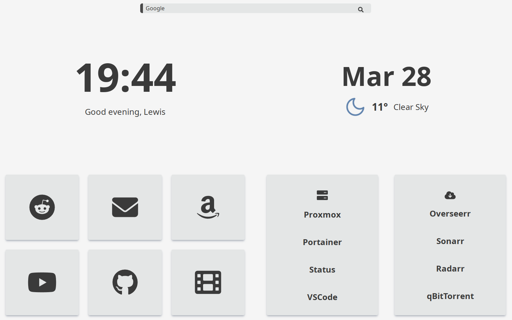

# 🖥 Bento-next

## An elegant dashboard, written with Vue, Tailwind, and Typescript<!-- omit from toc -->

**Note:** If you're upgrading from Bento-next v1, you'll need to pull the new `config.ts`

## [Demo](https://dash.lew.ooo)



<br />

[Upstream](https://github.com/migueravila/Bento)

## :point_down: Index

- [🖥 Bento-next](#-bento-next)
  - [Demo](#demo)
  - [:point\_down: Index](#point_down-index)
  - [:sparkles: Features](#sparkles-features)
  - [:rocket: Usage](#rocket-usage)
    - [:dolphin: In a Docker Container](#dolphin-in-a-docker-container)
      - [docker run](#docker-run)
      - [docker-compose](#docker-compose)
    - [:cloud: On GitHub Pages](#cloud-on-github-pages)
    - [:robot: On Vercel](#robot-on-vercel)
    - [:floppy\_disk: With a web server (nginx, apache, etc...)](#floppy_disk-with-a-web-server-nginx-apache-etc)
    - [:lock: SSL](#lock-ssl)
  - [:wrench: Customization](#wrench-customization)
    - [:hammer\_and\_wrench: General](#hammer_and_wrench-general)
    - [:clock5: Clock](#clock5-clock)
    - [:art: Themes](#art-themes)
    - [:mag: Search Bar](#mag-search-bar)
    - [:wave: Greetings](#wave-greetings)
    - [:triangular\_ruler: Layouts](#triangular_ruler-layouts)
    - [:cloud\_with\_rain: Weather](#cloud_with_rain-weather)
      - [Setting the OpenWeatherMap API key](#setting-the-openweathermap-api-key)
    - [:moon: Auto change theme](#moon-auto-change-theme)
    - [:card\_file\_box: Buttons \& Lists](#card_file_box-buttons--lists)
    - [:stop\_sign: Disabling components](#stop_sign-disabling-components)
  - [:fork\_and\_knife: Changes and Contributing](#fork_and_knife-changes-and-contributing)
    - [:paintbrush: Custom Themes](#paintbrush-custom-themes)
    - [:open\_file\_folder: Contributing Changes](#open_file_folder-contributing-changes)
    - [:keyboard: Development Environment](#keyboard-development-environment)
      - [Prerequisites:](#prerequisites)
      - [Setup:](#setup)
      - [Building:](#building)
        - [Docker:](#docker)
        - [With an HTTP server (e.g. NGINX):](#with-an-http-server-eg-nginx)
        - [GitHub Pages:](#github-pages)

## :sparkles: Features

- **Themes**: Bento-next ships with 9 included themes, such as Catppuccin, Nord, Arc, and Solarized, each with their own light/dark palletes.
- **Local storage**: Using someone else's instance? Change the theme and name for you and you only with the theme menu, or by clicking the name text.
- **Easy configuration**: with the included `config.ts` file.
- **Dark/Light**: toggleable through your browser or [automatically](#moon-auto-change-theme).
- **Layouts**: adjust the layout of Bento to fit your needs and workflow.
- **Clock and Date**: 24/12 hour, with an optional animated separator.
- **Icons**: Bento-next supports a huge array of icons from [FontAwesome](https://fontawesome.com).

## :rocket: Usage

Bento-next currently supports running in a Docker container (recommended), on GitHub Pages, Vercel, or hosted with your own web server.

### :dolphin: In a Docker Container

You can run Bento in a Docker Container, either with `docker run`, or with the included `docker-compose` file.

#### docker run

 1. Clone this repo to pull the config.ts file: `git clone https://github.com/lewisdoesstuff/bento-next/`
 2. Run the following `docker` command, providing the path to the config.js file, changing port mappings if needed.
 3. `# docker run -it -d -p 80:8080 -v <config.ts location>:/usr/share/nginx/html/config.ts lewisdoesstuff/bento-next`

#### docker-compose

  1. Clone this repo with `git clone https://github.com/lewisdoesstuff/bento-next/`
  2. Edit port mappings, and provide a path to the config.js file in `docker-compose.yml`
  3. `cd` into the cloned repo, then run `# docker-compose -d up` to start.

### :cloud: On GitHub Pages

Bento supports being hosted through GitHub Pages using a workflow action

   1. Fork this repo from GitHub.
   2. Clone your fork with `git clone https://github.com/{YOUR_GITHUB_ACCOUNT}/{FORK_NAME}`.
   3. Make any changes to the config you require.
   4. Edit `./github/pages.yml`, changing `lewisdoesstuff` to your GitHub username.
   5. If the name of your repo is not `bento-next`, edit `package.json`, changing the `base` path for `build-pages` (line 7) to the name of your repo, including the leading and trailing `/`
   6. Create a new commit and push your changes to `origin/master`.
   7. Once pushed, you should see the "Build and Publish to Pages" workflow running under the Actions tab. (I'd recommend also removing the Docker build workflow while here.)
   8. Create a new github page with `gh-pages` branch.
   9. Access your Bento-next install at `https://{YOUR_GITHUB_ACCOUNT}.github.io/{FORK_NAME}`

### :robot: On Vercel

Bento can also be hosted easily on [vercel](https://vercel.com/dashboard).

  1. Fork this repo from GitHub.
  2. Clone your fork with `git clone https://github.com/{YOUR_GITHUB_ACCOUNT}/{FORK_NAME}`.
  3. Make any changes to the config you require and push the changes.
  4. Add new project on Vercel.
  5. Connect your GitHub account and Import your Forked Repo.
  6. Change framework preset to Vue.js and Click on Deploy.
  7. Access your deployment at `https://{VERCEL_PROJECT_NAME}-{VERCEL_USER_NAME}.vercel.app`

### :floppy_disk: With a web server (nginx, apache, etc...)

  1. Clone this repo with `git clone https://github.com/lewisdoesstuff/bento-next/`
  2. `cd bento-next` to enter the cloned repo.
  3. `npm install` to install node modules.
  4. `npm run build` to build the app.
  5. Copy the files placed in `./dist` to your webservers html directory. eg: `cp ./dist/* /usr/share/nginx/html -r`

### :lock: SSL

Bento-next doesn't support SSL (https) connections by default, serving the page over port 8080.
If you'd like to add SSL support (recommended), I recommend using a reverse-proxy such as [NGINX Proxy Manager](https://github.com/NginxProxyManager/nginx-proxy-manager) to add your SSL certificate to the host.

## :wrench: Customization

All settings can be managed in the `config.ts` file:

### :hammer_and_wrench: General

Change the default name (displayed to all users), choose if links open in a new tab, and change the window title.

```js
  // General
  name: "John",
  openInNewTab: true,
  title: "Bento",
```

### :clock5: Clock

Adjust 12/24hr format, or enable an animated separator.

```js
  // Clock
  twelveHourFormat: false,
  flashSeparator: false,
```

### :art: Themes

Bento-next supports 9 pre-included themes, if you'd like to add more, please see the steps at [Custom Themes](#paintbrush-custom-themes)
Included themes:
  
- [Arc](https://github.com/horst3180/arc-theme)
- Bento (default)
- [Catppuccin (Frappe, Macchiato, Mocha)](https://github.com/catppuccin/catppuccin)
- [Concept-Dark](https://www.deviantart.com/zb652/art/Concept-Dark-885878180)
- [Monokai (free)](https://monokai.pro/)
- [Nord](https://www.nordtheme.com/)
- Sakura
- [Solarized](https://ethanschoonover.com/solarized/)
- [Summer](https://github.com/JhonnyRice/summer)

You're also able to set a custom background image in the config. You can either place the file in `./src/assets/images/` and provide the file name, or provide a link to the image.

```js
  // Theme
  theme: "bento",

  // Place a background image in ./src/assets/images/ and provide the file name.
  // Alternatively, provide a URL to an image. If the page is served over https, you may have issues loading images from insecure origins.
  // Set to "" to disable.
  backgroundImage: "", 
  themes: [
    // List of installed themes, add your own themes in ./src/assets/css/themes and include it in the array below.
    "arc",
    "bento",
    "catppuccin-frappe",
    "catppuccin-macchiato",
    "catppuccin-mocha",
    "conceptdark", // dark mode only
    "monokai",
    "nord",
    "sakura",
    "solarized",
  ],
```

### :mag: Search Bar

Bento-next includes a search bar by default. You can change the search engine and placeholder text as below

```js
  // Search Bar
  searchBar: true,
  searchEngine: "google", // google, ddg
  barPlaceholder: "", // if blank, use search engine name. Set to ' ' for no placeholder.
  autoFocusBar: true,
```

### :wave: Greetings

Edit the displayed greetings for morning, afternoon, evening, and night.

```js
  // Greetings
  greetingMorning: "Good morning,",
  greetingAfternoon: "Good afternoon,",
  greetingEvening: "Good evening,",
  greetingNight: "Sweet dreams,",
```

### :triangular_ruler: Layouts

Bento has three different layouts `bento`, `lists`, and `buttons`. `Bento` is a split with buttons on the left and lists on the right. `Lists` swaps the buttons out for another list container, and `buttons` does the same with buttons.

```js
  // Layout
  bentoLayout: 'bento', // 'bento', 'lists', 'buttons'
```

If you want to customize all your extra buttons and lists go to [:card_file_box: Buttons & Lists](#card_file_box-buttons--lists)

### :cloud_with_rain: Weather

Bento provides a weather widget that pulls data from OpenWeatherMap. To use this, you'll need to add an API key to the settings. You can generate a free API key from [OpenWeatherMap](https://openweathermap.org/api). You'll need a "Current Weather Data" key.

You can provide a default lat/long, or have Bento automatically pull your location from your browsers location data.
If this isn't available, or you deny location permissions, Bento will fall back to using the lat/long set in the config.

Finally, choose an icon set:

- **OneDark** (_Default_) Using the One Dark Pro color scheme
- **Nord** Using the Nord Color Scheme
- **Dark** For White theme only users that want a minimalist look
- **White** For Dark theme only users that want a minimalist look

```js
  // Weather
  weatherKey: import.meta.env.VITE_API_KEY, // Set your OpenWeatherMap key in .env - Move the included .env.example to .env
  weatherIcons: "OneDark", // 'Onedark', 'Nord', 'Dark', 'White'
  weatherUnit: "C", // 'F', 'C'
  language: "en", // More languages in https://openweathermap.org/current#multi

  trackLocation: true, // Request location from the browser. If false, or location is denied, use the coordinates below.
  defaultLatitude: "37.775",
  defaultLongitude: "-122.419",
```

#### Setting the OpenWeatherMap API key

To set the OpenWeatherMap API key, you'll need to create a `.env` file.  
Bento-next includes a `.env.example` file, just move this to `.env`, and add your API key inside.

### :moon: Auto change theme

Bento-next can automatically swap your theme (light/dark) using 1 of 4 modes

```js
  // Automatic theme switching:
  // "system" - Switches based on OS color preference
  // "location" - Switches based on local sunrise/sunset (requires OpenWeatherMap API key)
  // "preset" - Switches based on set hours
  // "none" - No automatic switching
  autoTheme: "system",
```

If you're using `'preset'` as the theme switching mode, you can set the hours to switch below

```js
  // If autoTheme is set to "preset", set the hours below.
  darkModeOnTime: "18:30",
  lightModeOnTime: "07:00",
```

### :card_file_box: Buttons & Lists

Every entry in the buttons or lists containers are editable through here! A breakdown of the object is below.

```js
  // Buttons
  buttons: [
    // First buttons group
    // If you're using the 'bento' layout, this is the only group that will be used.
    [
      {
        name: "Github", // set the name of the card
        icon: "fab-github", // provide a FontAwesome icon name. Regular icons (fa-) don't require a prefix, while FA-Brands icons must be prefixed with "fab-"
        url: "https://github.com/", // provide a link to the page.
      },
    ]
  ]
```

```js
  // Lists
  lists: [
    // First list group
    // If you're using the 'bento' layout, this is the only group that will be used.
    [
      {
        icon: "music", // Icon for the list to use. The same as the buttons.
        links: [
          {
            name: "Inspirational", // Display text for the link
            url: "https://www.youtube.com/watch?v=dQw4w9WgXcQ", // URL to the page
          },
          {
            name: "Classic",
            url: "https://www.youtube.com/watch?v=dQw4w9WgXcQ",
          },
          {
            name: "Oldies",
            url: "https://www.youtube.com/watch?v=dQw4w9WgXcQ",
          },
          {
            name: "Rock",
            url: "https://www.youtube.com/watch?v=dQw4w9WgXcQ",
          },
        ],
      }
    ]
```

### :stop_sign: Disabling components

If you don't want to have a specific component enabled, you can disable it in `config.js`  
To disable, just set the component you'd like to remove to `false`.  
Please note disabling some components won't scale the others to fill in the gaps, but the layout should be usable. Disabling the theme button requires you to set the theme in `config.js`.

```js
  // Set any of the below options to false to disable drawing the component on the page.
  // If themeButton is set to false, the theme can only be set in this file.
  // Disabling the weather component may cause issues with location-based light/dark switching.
  componentsEnabled: {
    searchBar: true,
    themeButton: true,
    clock: true,
    greeter: true,
    date: true,
    weather: true
  }
```

## :fork_and_knife: Changes and Contributing

### :paintbrush: Custom Themes

Bento can be expanded with user-defined themes! To create one, add a new .css file to `./public/css/themes/`, then add it to the array of themes in `config.ts`.
If you've got a theme you'd like to see included, please open a PR, or open an issue with a link to the color palette.
Example:

```css
:root {
  /* Light Colors  */

  --background: #f5f5f5; /* Background color */
  --accent: #57a0d9; /* Hover color */
  --cards: #e4e6e6; /* Cards color */

  /* Fonts Color */
  --fg: #3a3a3a; /* Foreground color */
  --sfg: #494949; /* Sceondary Foreground color */

  /* Image background  */
  --imgcol: linear-gradient(rgba(255, 255, 255, 0.7), rgba(255, 255, 255, 0.7)); /* Filter color */

  /* Dark Colors  */

  --darkbackground: #19171a; /* Background color */
  --darkaccent: #57a0d9; /* Hover color */
  --darkcards: #201e21; /* Cards color */

  /* Fonts Color */
  --darkfg: #d8dee9; /* Foreground color */
  --darksfg: #2c292e; /* Secondary Foreground color */

  /* Image background  */
  --darkimgcol: linear-gradient(rgba(0, 0, 0, 0.85), rgba(0, 0, 0, 0.85)); /* Filter color */
}
```

### :open_file_folder: Contributing Changes

I'd be thrilled to hear about any changes that you've made to the project!  
If you feel that these would work as a default feature, please submit a PR with your changes!  
For anything that you feel may be better suited to the upstream project, please port your changes to vanilla HTML/JS and open a PR on [migueravila/Bento](https://github.com/migueravila/Bento).

While I don't have a specific contributing guide, or code style to follow, please ensure your changes follow the general style of the program, and respect any existing features (no breaking changes, please!)  
Please ensure that any PR's don't contain changes to the default `config.js` values, unless you need to add another. Please also ensure to remove your OpenWeatherMap API key!

### :keyboard: Development Environment

To make changes to Bento-next, you'll need to follow a few steps to set up your development environment.
For this, we'll assume a Linux system, but this will work the same on Windows with WSL.

#### Prerequisites:

- Node JS
- NPM
- A text editor (VSCode is recommended.)

#### Setup:

Setting up a working dev environment is fairly straightforward with the below steps. These are platform agnostic, so you shouldn't need to make any changes depending on platform.

 1. Clone the repo with `git clone https://github.com/lewisdoesstuff/bento-next`, or your preffered Git client.
 2. `cd bento-next` to enter the cloned repo.
 3. Install dependencies with `npm install`
 4. Open the folder in your preffered text editor to begin developing!
 5. Start the dev server with `npm run dev`.
 6. Connect to the local instance at `https://localhost:5173`.

#### Building:

Once you've made your changes, you'll want to build for production to remove any unused CSS (a lot), and generally speed up the site.

##### Docker:

Docker is the recommended way to run Bento-next, and building a docker container with your changes is very straightforward!
You'll need `docker` installed to build and run the image.

  1. Ensure you're in the repo's root directory
  2. Build the docker container with `docker build . -t bento-next`
  3. Wait for the build to complete, then run the image in a new container with `docker run -it -d -p 8080:8080 --rm --name bento-next bento-next`. You can edit port mappings (left side port), or remove the `-d` flag if you'd like to see the output of the build and HTTP server.

##### With an HTTP server (e.g. NGINX):

You're able to run the production build of Bento-next with any HTTP server, as you don't need Node installed to host the page.
This isn't the recommended way to run Bento, and I won't be able to offer support for web server-specific issues.

  1. Build Bento-next for production with `npm run build`.
  2. Wait for the script to complete, then `cd dist/` to enter the output folder.
  3. Copy the files to your webservers HTML directory, or point a web server at the `./dist` folder.
  4. Start your web server, and access Bento-next over your assigned port.

##### GitHub Pages:

If you're hosting Bento-next on GitHub Pages, this will be automatically built and published once you push your changes to `master`!
